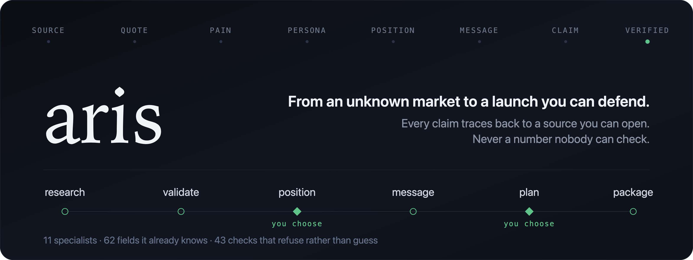

<p align="center">
  
</p>

<p align="center">
  <b>Describe your product. Get a launch package your team can act on and a reviewer can check.</b><br>
  A marketing research team for Claude Code, with the evidence built in.
</p>

<p align="center">
  
  
  
  
  
</p>

---

You describe your product; aris researches the market from the public record, works out
the positioning, writes every launch asset, checks its own work, and hands you one file
you open in a browser where **clicking any sentence shows you the source it came from**.

---

## How it runs

```
     you                                                        you        you
   describe                                                   review     decide
      │                                                          │          │
      ▼                                                          ▼          ▼
  ┌────────┐   ┌──────────┐   ┌─────────┐   ┌──────┐   ┌─────────┐   ┌────────┐
  │research│──▶│ position │──▶│ message │──▶│ plan │──▶│ package │──▶│ launch │
  └────────┘   └────┬─────┘   └─────────┘   └──┬───┘   └─────────┘   └───┬────┘
   who else         │           what do        │         one page        │
   is here,         ▼           we say         ▼         you can         ▼
   what hurts   you choose                 you choose    share       ┌────────┐
                the direction              channels                  │  keep  │
                                           and price                 │  them  │
                                                                     └────────┘
                                                              activation, retention,
                                                              twelve weeks of cadence
```

It stops **only** where a person has a real choice, and shows you options it has already
written out — never a blank question. Anything the sources cannot settle becomes a
labelled assumption and the chain keeps going, because correcting a written positioning
takes three seconds and inventing one from nothing takes an afternoon.

## Start here

**1. Install Claude Code**, if you haven't: [claude.com/claude-code](https://claude.com/claude-code)

**2. Add aris** — type this inside Claude Code:

```
/plugin marketplace add meoghetanca/aris
/plugin install aris-assets@aris
```

That pulls everything else it needs automatically.

**3. Check it's ready:**

```
/aris-setup
```

**4. Go:**

```
/arisflow "a shift-scheduling app for Vietnamese restaurants"
```

Or just *talk about marketing* — "who else is doing this?", "what should we say?",
"where should we launch?" — and it works out which step you need.

**There is nothing else to set up.** No accounts, no API keys, no config file, no
install commands in a terminal. If you can run Claude Code, you can run this.

---

## What you get

It stops **six times** to show you options it has already written out, you pick one,
and it carries on — seven decisions in all, because `/aris-gtm` settles both the
channel mix and the price point. At the end:

```
.aris/package/aris-launch.html
```

One file. Twelve sections behind three tabs — **what we know**, **what we do**,
**what happens after**. Open it in any browser, works offline, share it by sending
the file.

| | | |
|:--|:--|:--|
| *what we know* | **01 The field** | who else is selling to these people, what they charge, what they claim — read off their own pages |
| | **02 Customers** | what buyers actually said, ranked by how many said it — click a pain to read their words |
| | **03 Size** | the arithmetic shown, as a range, because the weakest factor sets the width |
| | **04 Risk** | every assumption this rests on, and every step that was cut |
| | **05 Evidence** | every source, and what used it |
| *what we do* | **06 Position** | the chosen direction and why, with the rejected two and their reasons |
| | **07 Message** | what to say, in priority order, each carrying the evidence it rests on |
| | **08 Channels** | where to say it, and what it costs |
| | **09 Assets** | emails, social posts, ads, FAQ, sales deck, PR, launch post |
| | **10 Next** | what to do first, and what verification is still blocking |
| *what happens after* | **11 Keeping them** | lifecycle emails that fire on what someone did, a twelve-week cadence, the first ninety days as decision points, and the growth rules — if CAC goes above X for 14 days, do Y |
| | **12 Measure** | the dashboard, deliberately empty until real data arrives |

Personas and demand signals have no section of their own on the page. They are
written to `.aris/intel/`, and what they produce — who the messaging is aimed at,
what the demand does and does not prove — shows up inside the sections above.

---

## Why not just ask an AI to write marketing copy?

Because you get something that reads beautifully and contains numbers nobody can
source — and no way to tell which ones.

aris makes that **mechanically impossible**:

- Every factual sentence carries an id. If that id has no source, **the tool refuses
  to publish**. Not a warning — a refusal.
- A pain is only "validated" at **8+ quotes from 3+ separate sources**. Below that it
  stays marked insufficient and nothing is built on it.
- Testimonials are written as `[TESTIMONIAL - SUPPLY REAL]`. If a made-up quote
  appears instead, **the build stops**.
- Market sizes are recomputed from their factors by a script. A number that doesn't
  add up fails.
- `unknown` is a valid, shippable answer. The failure this exists to prevent is
  `unknown` quietly becoming `verified`.

## It knows your field

Marketing an HR tool is not like marketing a music app. aris ships **53 specific fields
across 9 families**, covering where that field's customers actually talk, who can veto a
purchase, which channels it has repeatedly failed with, and **which claims it is not
legally allowed to make**.

| Family | Covers |
|:--|:--|
| `b2b-saas` | HR, sales tech, dev tools, security, legal, accounting, BI, support, PM, martech, proptech, logistics, restaurant, construction, agri, edtech |
| `consumer-app` | streaming, gaming, fitness, dating, travel, creator tools |
| `marketplace` | food delivery, mobility, freelance, and two-sided platforms generally |
| `regulated-finance` | wealth, banking, insurance, payments, lending, crypto |
| `regulated-health` | health platforms, telehealth, mental health, medical devices |
| `physical-goods` | DTC, beauty, fashion, food & drink, pet, home & hardware |
| `services` | agencies, hospitality, real estate, events, tutoring |
| `industrial-b2b` | manufacturing, freight, energy, telecom |
| `public-sector` | govtech, nonprofit |

A fintech product can never promise a return. A health product can never say it treats
anything. A food brand can never make a health claim. aris enforces that automatically,
naming the authority behind each rule.

**Fields inherit.** Pet insurance isn't listed, but it resolves to `insurance`, which
inherits every constraint of `regulated-finance`. A field nobody has researched still
lands on its family and says so loudly — so coverage is "any B2B SaaS, any consumer app,
any regulated-finance product", not a list of 53. Only something no family can honestly
claim fails closed, and `/aris-sector <name>` researches it properly.

## The specialists

Eleven roles, dispatched in parallel, each seeing only its own slice:

| | |
|:--|:--|
| `aris-category-scout` | one cheap pass over the whole category — the default; the deep analysts are opt-in |
| `aris-miner` | one per platform — mines the public voice. No Write. |
| `aris-competitor-analyst` | one per competitor — never sees another's profile |
| `aris-sizing-analyst` | one per sizing factor — so nobody completes the chain to make the arithmetic work |
| `aris-demand-analyst` | one per demand signal — measures, never concludes |
| `aris-channel-analyst` | one per channel — argues its case, never ranks the others |
| `aris-evaluator` | one per persona — tests the messaging against that persona's evidence |
| `aris-copywriter` | one per asset — the only one with Write, and it cannot invent a claim |
| `aris-claim-verifier` | **opens each cited page and answers whether it supports that exact sentence** |
| `aris-compliance-reviewer` | the regulated-claims lens, and it never sees who wrote the copy |
| `aris-sector-researcher` | bootstraps a field the base doesn't cover |

Ten of the eleven have **no Write or Edit**, deliberately. A reviewer who rewrites has
already decided how to resolve the finding, and that decision isn't theirs: "clinically
proven" can be fixed by citing a trial or by deleting the claim, and those are
completely different products.

---

## What it will not do

Honest limits, because they matter more than the feature list:

- **It never talks to a customer.** It reads what people wrote publicly. That finds
  everything wrong with your competitors — but not the thing nobody has put into words
  yet, which is often where the real opportunity is. Every package prints this warning
  on its front page.
- **It does not set your price or your budget.** It recommends; you decide.
- **It does not press publish.** You review the file, then grant permission by hand.
- **It does not build the landing page.** It writes the copy deck to
  `assets/landing-brief.md` and hands that to
  [pica](https://github.com/vqdungwork/pica), which builds the page and the Figma file.

---

## Commands

| | |
|:--|:--|
| `/arisflow "<product>"` | the whole chain |
| `/arisflow --auto` | unattended: takes the recommended option everywhere and records it |
| `/aris-status` | where this project stands |
| `/aris-verify` | run every check |
| `/aris-setup` | check and fix what's missing |
| `/aris-evidence` | what a run could not read, and how to hand it over yourself |
| `/aris-runway` | the ninety days after launch |

The fifteen individual steps — `/aris`, `/aris-category`, `/aris-voc`,
`/aris-personas`, `/aris-size`, `/aris-demand`, `/aris-position`, `/aris-messages`,
`/aris-gtm`, `/aris-assets`, `/aris-verify`, `/aris-harness`, `/aris-playbook`,
`/aris-runway`, `/aris-package` — can each be run on their own. Every one states
what it needs and stops if that's missing, naming the command that produces it.

## What it costs to run

The expensive part is **reading the internet, once**. That happens in `/aris-voc`,
which fans out one researcher per platform so the raw pages never enter your main
conversation. Everything after that is written to disk, so re-running a step or
changing a decision is cheap.

Just having aris installed costs roughly **2,000 tokens** of context — it loads the step
and specialist *descriptions*, not their instructions. A step's full instructions load
only when that step runs, and the 62 sector files are read by script and never enter
context at all.

## For developers

```
.aris/
├── state.json     the run, its decisions and its authorisation
├── assumptions.json, cutSteps.json
├── intel/        category, sources, pains, personas, size, demand
├── strategy/     positioning, messaging, go-to-market
├── assets/       every launch material + the claim registry
├── verification/ what passed, what blocks
├── harness/      metrics contract + analyzer
├── playbook/     conditional growth rules + the ninety-day runway
└── package/      manifest + aris-launch.html
```

**JSON is the source of truth. Markdown is the human deliverable. Scripts are the
validation.** The HTML is a presentation layer over the JSON, never a replacement.

The spine every check enforces:

```
SOURCE -> QUOTE -> PAIN -> PERSONA -> POSITIONING -> MESSAGE -> ASSET -> CLAIM -> VERIFICATION
```

Four packages: `aris-core` (state, sectors, decisions, gates, the publish hook),
`aris-intel` (research), `aris-strategy` (positioning, messaging, GTM), `aris-assets`
(materials, harness, playbook, the HTML build).

### Test

The gates are verified against a fixture project that is **not distributed**: a run's
fixture carries real product and market research, which belongs to whoever ran it.

If you are working on aris itself, build one by running `/aris` on any product and
pointing a harness at the resulting `.aris/` directory. What a harness must prove is
both directions: that a clean package passes, and that **each gate refuses when its
defect is planted** — a pain below threshold, an unevidenced persona attribute, a size
that does not recompute, an uncited claim, an unsupported superlative, a fabricated
testimonial, an invented pre-launch baseline, a dangling id.

A gate that has never failed in testing is a gate nobody has evidence about.

### Requires

Node (Claude Code needs it anyway). Nothing else — no Python, no package install, no
build step. `superpowers` and `pica` install automatically and aris degrades gracefully
without either.

---

## Status

**v0.1.0.** Run once, end to end, against a real product in a real market. That run
changed the tool more than any amount of design did, and the findings worth knowing
before you use it are these:

- **The big review sites block automated fetching.** G2, Capterra and TrustRadius all
  return 403, and most sector entries name them as the primary place to look. Use
  `/aris-evidence` when it happens; a blocked source becomes a two-minute paste rather
  than a silent gap, and a thin result must never be reported as a quiet market.
- **Prices are frequently unreadable by a plain fetch**, injected by JavaScript and
  chosen by the visitor's country. A fetch that returns no number has not proved the
  price is unpublished.
- **Do not let the model pick the competitors.** It picks whoever has the best
  international SEO and misses the local incumbent a buyer already owns — which is the
  one whose absence wrecks a positioning. `/aris-category` discovers them in the
  market's own language first.
- **The run was stopped by its user partway through**, because the research step
  dispatched one deep agent per competitor. Every fan-out now has a hard budget and a
  cheap default, and depth is something you ask for.

The quote thresholds have still only been exercised on one market, and every sector's
`priceBands` are deliberately null until a run cites them.

Built on the shape of [pica](https://github.com/vqdungwork/pica) by Dung Vuong: state
on disk, rules loaded by name, and gates enforced by script rather than by good
intentions.

MIT.
